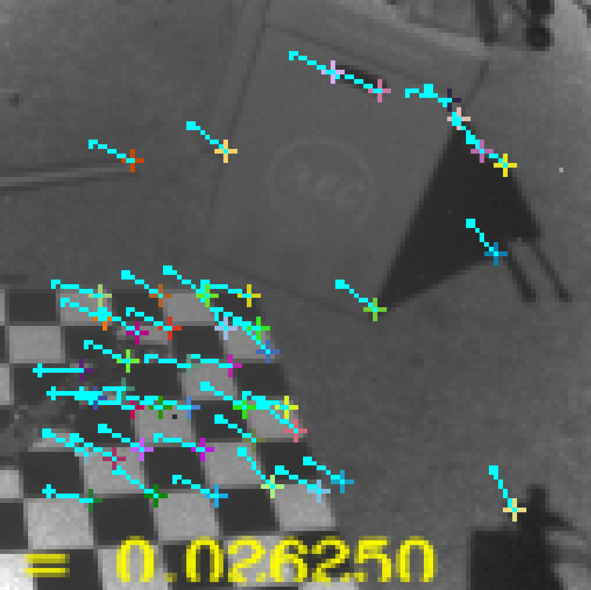
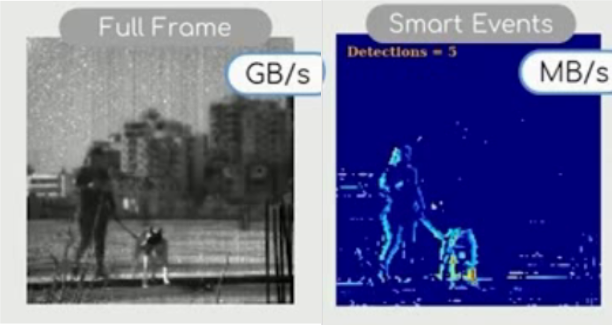
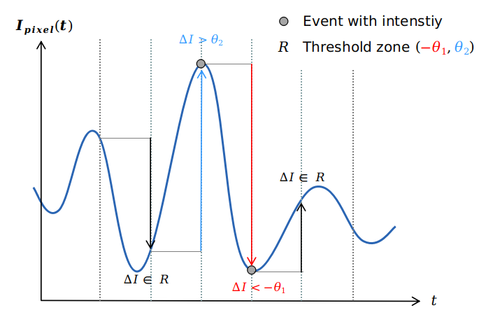
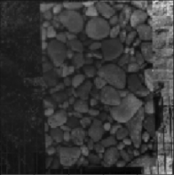
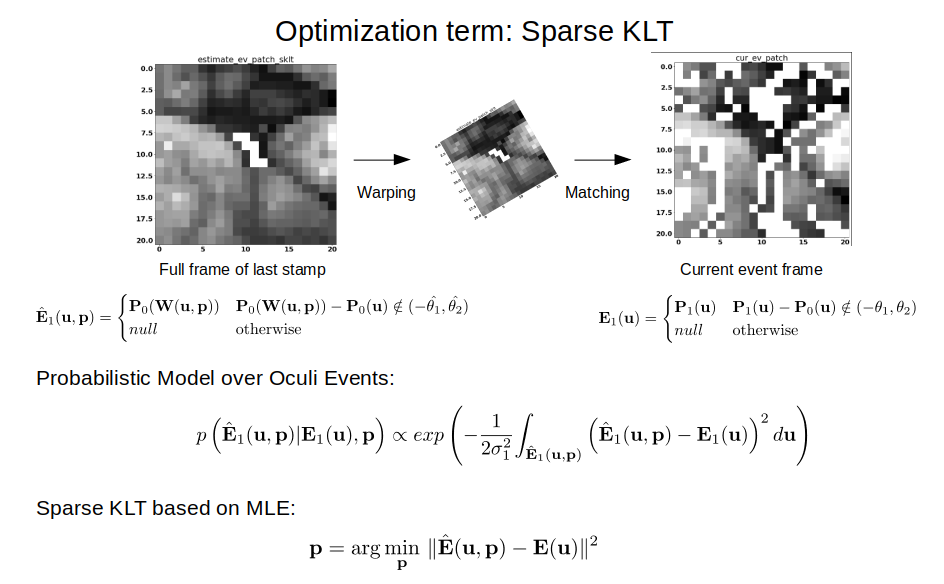
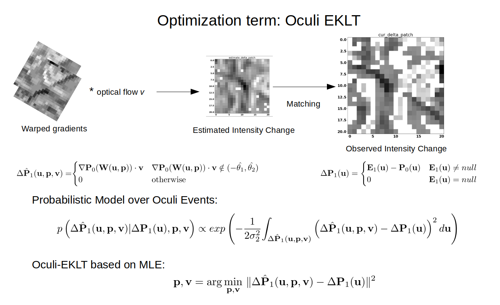
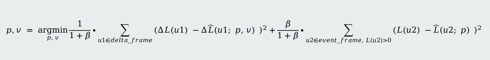
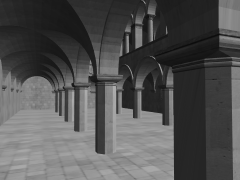
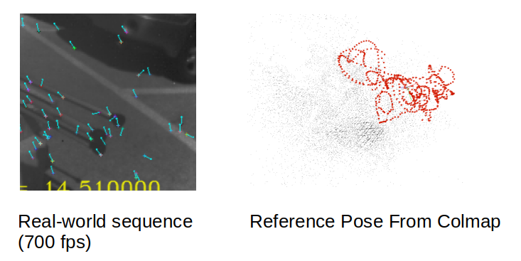
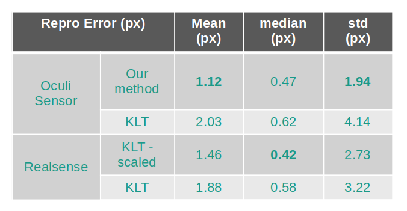

# Oculi-Feature Tracking: Tracking with Oculi events  
<figure>
       
    <figcaption>Feature Tracking</figcaption>
</figure>  

This repository implements the work of the student project [**Visual Odometry with new Unprecedented Event Camera**](https://rpg.ifi.uzh.ch/student_projects.php) by Yang Miao(yamiao@student.ethz.ch), supervised by Nico Messikommer, Daniel Gehrig and Prof. Davide Scaramuzza.  To our best knowledge, this is the <strong>first</strong> feature tracking framework that utilize events with abosolute intensity measurement.  

The code framework is based on [**EKLT**](https://github.com/uzh-rpg/rpg_eklt). According to the aggrement with RPG-UZH, the code is currently unavailable to public. If you need the code, please contact Yang Miao(yamiao@student.ethz.ch). 

## Tips  

1. "Implementation Details" are recommended for reading, which summarize the ideas of this project 
and provide the implementation details.
2. "scripts" folder contains python scripts used for data preprocess and conversion.  
3. "src/oculi_track" contains c++ source code for feature tracking with output of Oculi sensor.  
4. Getting familiar with EKLT would be very helpful for understanding this repository.

## Implementation Details

------  
### 1. Introduction of Oculi events  
Unlike standard event cameras, Oculi event camera output events which contains full intensity instead of polarity, as shown in the image below:  
<figure>
    . 
    <figcaption>Full frame and event frame</figcaption> 
</figure>  
The generation of the Oculi events is also different with existing standard event cameras.  
As shown by the image above, the events are generated when change of pixel intensity is larger than certain threshold compared to intensity in the last sampling time. In order words, the events are generatede synchronously, but at a very high frame rate (up to 30,000 Hz).  
<figure>
    .
    <figcaption>Generation of Oculi events</figcaption>   
</figure>  

Based on this unprecedented property, We design an novel feature tracking algorithms which outperform existing algorithms with only full-frame images.

### 2. Data conversion of raw Oculi data  

#### 2.1 Visualization of raw Oculi Data  

  

The scripts for visualizaiton of Oculi full frames and event frames are **"scripts/playback.py"** and **"scripts/playback_events.py"**.

    playback.py -i $(Oculi full frame file)  

    playback_events.py -i $(Oculi event frame file)  

#### 2.2 Conversion of raw Oculi Data

**"scripts/Oculi_to_rosbag.ipynb"** convert the oculi data to rosbag with messages of full frame and Oculi event frames.

### 3. Feature Tracking algorithms

The Oculi events has two main properties: i. containing intensity instead of polarity and ii. generated with large intensity change.  
Based on the two properties, we come up with a optimization-based patch matching for feature tracking. The loss function of the optimization framework consists of sparse KLT term and Oculi EKLT term, which correspont to the two properties respectively.  
As KLT, brightness constancy, temporal consistency and spatial coherency are assumed for our feature tracking algorithms.   

#### 3.1 Sparse KLT term

As the name "Sparse KLT" denotes, the term is calculated with sparse pixels in the feature patch where there are Oculi events. We assume the noise of pixel intensity is Gaussian-distributed. The optimization term is trying to match the warped patch of last frame to current observed event frame. Warping parameter is optimized during this process. The process is shown in the image below:  
<figure>
    .
    <figcaption>Spare KLT Term</figcaption>   
</figure> 

#### 3.2 Oculi EKLT term

Another property of the Oculi events is that events are generated with large intensity change.  
In order to make use of that property for feature matching, firstly the gradient of updated fullframe is calculated. After that the gradient frame is warped and then times optical flow and thus the estimated intensity change is calculated and then matched to the observed delta event frame(event frame - last updated frame). Similarly, Gaussian noise is assumed for the intensity change frame.
The process is shown in the image below:  
<figure>
    .
    <figcaption>Oculi events Term</figcaption>   
</figure> 

#### 3.3 Optimization framework

The two terms are then combined together for jointly optimization of warping parameter W and optical flow v:  
<figure>
    .
    <figcaption>Oculi events Term+Spare KLT Term</figcaption>   
</figure> 

### 4. Experiments

Both simulated and real-world experiments are conducted to show effectiveness of our algorithms.  

#### 4.1 Experiments with synthesized data  
Sponza dataset(rendered within 3D model) is used for simulation, as it has ground truth feature location.  
The Sponza model looks like this:  

    

The result shows that the sparse KLT term achieves better feature age while the event term can achieve better tracking accuracy. Combining the two terms can make a balance between feature age and tracking accuracy:  

#### 4.2 Experiments with real-world data 

The real-world data is collected by Oculi company. We use trajectory from COLMAP to evaluate the feature tracking error:  

    

The result shows that our methods can achieve better tracking accuracy than existing method with Oculi sensor(127x127 pxs), and also achieve comparable accuracy with Oculi sensor as existing method with a much higher resolutional Realsense sensor(640x480 pxs):   

     

### 5. Usage
Like in EKLT, launch feature tracking with rosbag can be done with command:  

    roslaunch oculi_track oculi_tracking.launch tracks_file_txt:=$(tracks file) v:=1  
